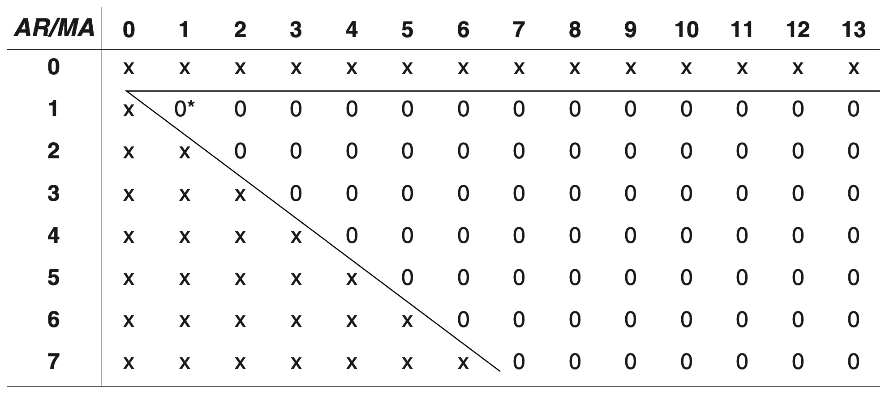

# 模型识别

> 对于给定的时间序列，如何选取适当的$$p, d, q$$值

## 样本自相关函数的性质

$$
r_k = \hat{\rho}_k = \frac{\sum\limits_{t=k
+1}^n (Y_t - \bar{Y})(Y_{t-k} - \bar{Y})}{\sum\limits_{t=1}^n (Y_t - \bar{Y})^2}, \quad k=1,2,\cdots
$$

$$
E(r_k) = \rho_k
$$

### 白噪声

$$
\text{Var}(r_k) \approx \frac{1}{n},\ \text{Corr}(r_k, r_j) \approx 0\ (k \neq j)
$$

### $$\text{AR}(1)$$过程

$$
\text{Var}(r_k)  \approx \frac{1}{n} \huge[\normalsize \frac{(1+\phi^2)(1-\phi^{2k})}{1-\phi^2} - 2k\phi^{2k} \huge]
$$

#### 特例

* $$k = 1$$时的方差 

$$
\text{Var}(r_1) \approx \frac{1-\phi^2}{n}
$$


$$\phi$$越接近$$\pm 1$$，对$$\rho_1$$的估计就越精确。


* $$k$$较大时的方差

$$
\text{Var}(r_k) \approx \frac{1}{n} \huge[\normalsize \frac{1+\phi^2}{1-\phi^2} \huge]
$$


$$\phi$$接近$$\pm 1$$意味着$$r_k$$有较大的方差。


* $$r_1$$和 $$r_2$$的相关系数

$$
\text{Corr}(r_1, r_2) \approx 2\phi \sqrt{\frac{1-\phi^2}{1+2\phi^2-3\phi^4}}
$$

### $$\text{MA}(q)$$过程

$$
\text{Var}(r_k) = \frac{1}{n} \huge[\normalsize 1 + 2\sum_{j=1}^q \rho_j^2 \huge]\normalsize, \quad k>q
$$

在模型检验中可以用$$r$$来代替$$\rho$$以得到对$$r_k$$的估计。对时间序列是$$\text{MA}(q)$$的假设的验证可以通过**把**$$r_k$$**与正负2倍标准误差相比**来完成。当且仅当$$r_k$$落在这个范围外拒绝零假设。

#### $$\text{MA}(q)$$过程假设检验的标准误差边界

* 简单标准误差： $$\pm \Large\frac{2}{\sqrt{n}}$$  （`acf()`函数默认情况）
* 复杂标准误差： $$\pm \Large\frac{2}{\sqrt{n}} \normalsize\sqrt{1 + 2\sum\limits_{j=1}^q \rho_j^2}$$  （`acf(..., ci.type='ma', ...)`）

## 偏自相关函数和扩展的自相关函数

\*\*\*\*$$k$$**阶滞后偏自相关系数（PACF）：**消除中间介入变量$$Y_{t-1}, Y_{t-2}, \cdots, Y_{t-k+1}$$的影响后 $$Y_t$$和$$Y_{t-k}$$的的相关系数函数。

### 偏自相关函数的两种更精确定义

#### 基于正态分布

$$
\phi_{kk} = \text{Corr}(Y_t, Y_{t-k}\ |\ Y_{t-1}, Y_{t-2}, \cdots, Y_{t-k+1})
$$

 即$$\phi_{kk}$$二元分布 $$Y_t$$和$$Y_{t-k}$$的以 $$Y_{t-1}, Y_{t-2}, \cdots, Y_{t-k+1}$$为条件的相关系数。

#### 基于中间变量对$$Y_t$$的预测

用中间介入变量分别对$$Y_t$$和$$Y_{t-k}$$进行预测：

$$
Y_t = \beta_1 Y_{t-1} + \beta_2 Y_{t-2} + \cdots + \beta_{k-1} Y_{t-k+1} \\
Y_{t-k} = \beta_1 Y_{t-k+1} + \beta_2 Y_{t-k+2} + \cdots + \beta_{k-1} Y_{t-1}
$$

其中$$\beta$$的选择是使得均方误差最小

$$
\phi_{kk} = \text{Corr}(Y_t - \beta_1 Y_{t-1} - \beta_2 Y_{t-2} - \cdots - \beta_{k-1} Y_{t-k+1}, \\
Y_{t-k} - \beta_1 Y_{t-k+1} - \beta_2 Y_{t-k+2} - \cdots - \beta_{k-1} Y_{t-1})
$$

即$$\phi_{kk}$$为预测误差之间的相关系数。（对于正态分布的时间序列，两种定义一致）

通常取$$\phi_{11} = 1$$。

* $$\phi_{22}$$的计算

$$
\hat{Y}_t = \rho_1 Y_{t-1}
$$

（见[最小均方误差预测](forecasting.md)）

$$
\text{Cov}(Y_t - \rho_1 Y_{t-1},\ Y_{t-2} - \rho_1 Y_{t-1}) = \gamma_2 - 2\rho_1\gamma_1 + \rho_1^2\gamma_0 = \gamma_0 (\rho_2 - \rho_1^2)  \\
\text{Var}(Y_t - \rho_1 Y_{t-1}) = \text{Var}(Y_{t-2} - \rho_1 Y_{t-1}) = \gamma_0 (1 - \rho_1^2)
\\ \quad \\
\Rightarrow\ \phi_{22} = \text{Corr}(Y_t - \rho_1 Y_{t-1},\ Y_{t-2} - \rho_1 Y_{t-1}) = \frac{\rho_2 - \rho_1^2}{1 - \rho_1^2}
$$

对于$$\text{AR}(1)$$模型，$$\rho_k = \phi^k\ \Rightarrow\ \phi_{22} = \frac{\phi^2 - \phi^2}{1 - \phi^2} = 0$$ 

### $$\text{AR}(p)$$模型的偏自相关函数

$$
\phi_{kk} = 0, \quad k>p
$$

\*\*\*\*$$\text{AR}(p)$$**过程的偏自相关函数在滞后超过过程的阶数时截尾。**

### 对任意平稳过程的偏自相关函数求解

$$
\rho_j = \phi_{k1} \rho_{j-1} + \phi_{k2} \rho_{j-2} + \phi_{k3} \rho_{j-3} + \cdots + \phi_{kk} \rho_{j-k} \\ \quad \\
\Rightarrow\ \begin{cases} 
\rho_1 =  \phi_{k1} + \phi_{k2} \rho_1 + \phi_{k3} \rho_2+ \cdots + \phi_{kk} \rho_{k-1} \\ 
\rho_2 =  \phi_{k1} \rho_1 + \phi_{k2} + \phi_{k3} \rho_1+ \cdots + \phi_{kk} \rho_{k-2} \\ 
\qquad \qquad \qquad \qquad \vdots \\
\rho_k =  \phi_{k1} \rho_{k-1} + \phi_{k2} \rho_{k-2} + \phi_{k3} \rho_{k-3}+ \cdots + \phi_{kk} \\ 
\end{cases} \\ \quad \\
\Rightarrow \phi_{kk} = \frac{\det(D_k)}{\det(D)} \qquad \text{(Cramer's Rule)}
$$

对于$$\text{AR}(p)$$过程：

$$
\phi_{pp} = \phi_p
$$

### 样本偏自相关函数

递归求解方法：

$$
\phi_{kk} = \frac{\rho_k - \sum\limits_{j=1}^{k-1} \phi_{k-1,j} \rho_{k-j}}{1 -  \sum\limits_{j=1}^{k-1} \phi_{k-1,j} \rho_j}
$$

其中 $$\phi_{k,j} = \phi_{k-1,j} - \phi_{kk}\phi_{k-1,j-1}, \quad j = 1,2,\cdots, k-1$$。

用$$r$$代替上式中的$$\rho$$就可以得到估计的或样本偏自相关函数。

#### $$\text{AR}(p)$$情况下的假设检验

在$$\text{AR}(p)$$模型是正确的情况下：

$$
\hat{\phi}_{kk}\ \dot\sim\ N(0, \frac{1}{n})
$$

**当** $$k>p$$**时，用** $$\pm \Large\frac{2}{\sqrt{n}}$$**作为**$$\hat{\phi}_{kk}$$**的临界极限值来检验**$$\text{AR}(p)$$**模型是正确的零假设。**

### 混合模型

|  | AR\(p\) | MA\(q\) | ARMA\(p,q\) |
| :---: | :---: | :---: | :---: |
| **ACF** | 拖尾 | 滞后q阶截尾 | 拖尾 |
| **PACF** | 滞后p阶截尾 | 拖尾 | 拖尾 |
| **识别指标** | PACF | ACF | EACF |

### 扩展的自相关函数

通过EACF表格识别ARMA模型的阶数：

$$\text{ARMA}(p,q)$$模型在理论上有一个由零构成的三角模式，其左上角对应着ARMA模型的阶数。

如果样本EACF构成图形中出现了多个三角模式，那么需要单独将这些三角左上角对应的模型拿出来进行比较。

## 非平稳性

## 其他识别方法

