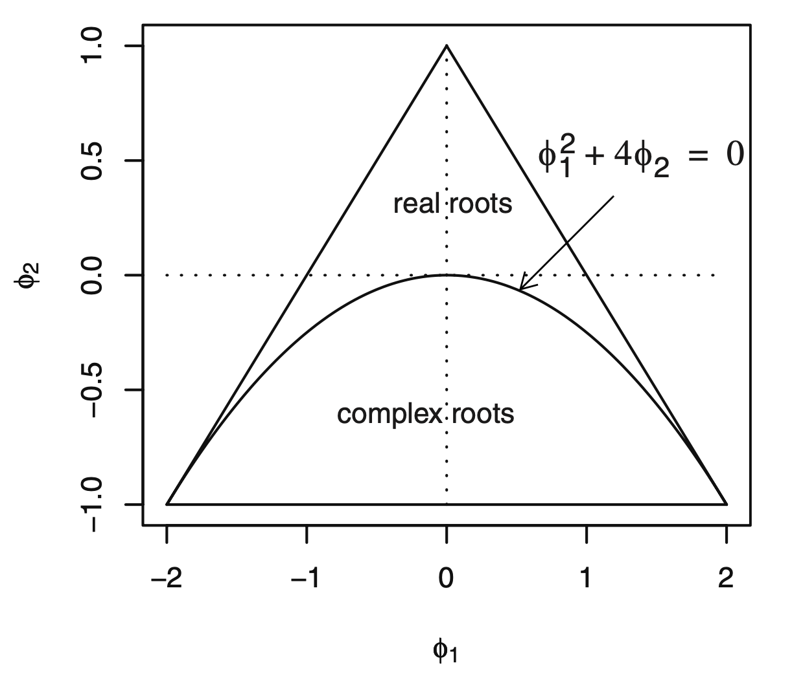

# 平稳时间序列模型

## 一般线性过程

$$
Y_t = e_t + \psi_1 e_{t-1} + \psi_2 e_{t-2} + \cdots \\
\quad \\
s.t.\ \sum_{i=1}^\infty \psi_i^2 < \infty,\ \psi_0 = 1
$$

### 特例：$$\psi$$为指数递减形式

$$\psi_j = \phi^j, \quad -1<\phi<1$$ 

$$
Y_t = e_t + \phi e_{t-1} + \phi^2 e_{t-2} + \cdots
$$

#### 指数递减形式一般线性过程的性质

* 均值：$$E(Y_t) = 0$$ 
* 方差：$$\text{Var}(Y_t) = \Large\frac{\sigma^2_e}{1-\phi^2}$$ 
* 协方差：$$\text{Cov}(Y_t, Y_{t-k}) = \Large\frac{\phi^k \sigma^2_e}{1-\phi^2}$$ → 只与 $$k$$ 有关，说明该过程平稳
* 自相关函数： $$\text{Corr}(Y_t, Y_{t-k}) = \phi^k$$ 

### 一般线性过程的性质

* 均值：$$E(Y_t) = 0$$ 
* 方差：$$\text{Var}(Y_t) = \sigma^2_e \sum\limits_{i=0}^\infty \psi_i^2$$ 
* 协方差：$$\text{Cov}(Y_t, Y_{t-k}) = \sigma^2_e \sum\limits_{i=0}^\infty \psi_i \psi_{i+k},\quad k\geq0$$ → 只与 $$k$$ 有关，说明该过程平稳

## 滑动平均过程

**q阶滑动平均过程** $$\text{MA}(q)$$**：**

$$
Y_t = e_t - \theta_1 e_{t-1} - \theta_2 e_{t-2} - \cdots - \theta_q e_{t-q}
$$

### 一阶滑动平均过程

$$
Y_t = e_t - \theta e_{t-1}
$$

#### 一阶滑动平均模型的性质

* 均值：$$E(Y_t) = 0$$ 
* 方差：$$\gamma_0 = (1+\theta^2)\sigma^2_e$$ 
* 协方差：$$\gamma_k = \begin{cases}  -\theta\sigma^2_e,\quad k=1 \\   0, \quad k\geq2 \end{cases}$$ 
* 自相关函数：$$\rho_k = \begin{cases}  -\frac{\theta}{1+\theta^2},\quad k=1 \\   0, \quad k\geq2 \end{cases}$$ 


当连续观测值密切正相关时，如果一个观测值高于序列平均值，那么下一个观测值往往也高于平均值，图形随时间的变化较为平滑，偶尔有大的波动。当连续观测值密切负相关时，如果一个观测值高于序列平均值，那么下一个观测值往往会低于平均值，图形随时间的推移呈锯齿状，围绕均值来回震荡。


### 二阶滑动平均过程

$$
Y_t = e_t - \theta_1 e_{t-1} - \theta_2 e_{t-2}
$$

#### 二阶滑动平均模型的性质

* 均值：$$E(Y_t) = 0$$ 
* 方差：$$\gamma_0 = (1+\theta_1^2+\theta_2^2)\sigma^2_e$$ 
* 协方差：$$\gamma_k = \begin{cases}  (-\theta_1+\theta_1\theta_2)\sigma^2_e, \quad k=1 \\ -\theta_2 \sigma_e^2, \quad k=2\\    0, \quad k\geq3 \end{cases}$$ 
* 自相关函数：$$\rho_k = \begin{cases}  \large\frac{-\theta_1+\theta_1\theta_2}{1+\theta_1^2+\theta_2^2}\normalsize,\quad k=1 \\  \large\frac{-\theta_2}{1+\theta_1^2+\theta_2^2}\normalsize, \quad k=2 \\   0, \quad k\geq3 \end{cases}$$ 

### 一般$$\text{MA}(q)$$过程

$$
Y_t = e_t - \theta_1 e_{t-1} - \theta_2 e_{t-2} - \cdots - \theta_q e_{t-q}
$$

#### q阶滑动平均模型的性质

* 均值：$$E(Y_t) = 0$$ 
* 方差：$$\gamma_0 = (1+\theta_1^2+\theta_2^2+\cdots+\theta_q^2)\sigma^2_e$$ 
* 协方差：$$\gamma_k = \begin{cases}  (-\theta_k+\theta_1\theta_{k+1}+\theta_2\theta_{k+2}+\cdots+\theta_{q-k}\theta_q)\sigma^2_e, \quad k=1,\dots,q \\ 0, \quad k>q \end{cases}$$ 
* 自相关函数：$$\rho_k = \begin{cases}  \large\frac{-\theta_k+\theta_1\theta_{k+1}+\theta_2\theta_{k+2}+\cdots+\theta_{q-k}\theta_q}{1+\theta_1^2+\theta_2^2+\cdots+\theta_q^2}\normalsize, \quad k=1,\dots,q \\ 0, \quad k>q \end{cases}$$  → 自相关函数在滞后q期“截尾”

## 自回归过程

**p阶自回归过程** $$\text{AR}(p)$$**：**

$$
Y_t = \phi_1 Y_{t-1} + \phi_2 Y_{t-2} + \cdots + \phi_p Y_{t-p} + e_t
$$

$$e_t$$ 包括了无法用过去值来解释的所有新信息，因此 $$e_t$$ 独立于 $$Y_{t-1}, Y_{t-2}, Y_{t-3}, \dots$$ 

### 一阶自回归过程

$$
Y_t = \phi Y_{t-1} + e_t \\
\quad \\
s.t.\quad \phi^2<1 \text{ or } |\phi|<1
$$

#### 一阶自回归模型的性质

* 均值：$$E(Y_t) = 0$$ 
* 方差：$$\gamma_0 = \large\frac{\sigma^2_e}{1-\phi^2}$$ 
* 协方差：$$\gamma_k = \large\frac{\phi^k\sigma^2_e}{1-\phi^2}$$ 
* 自相关函数：$$\rho_k = \phi^k$$ 


因为 $$|\phi|<1$$，随着滞后长度 $$k$$ 的增加，自相关函数呈指数递减。

* $$0<\phi<1$$：自相关函数为正，得到相对平滑的序列，时间序列存在大量惯性 
* $$-1<\phi<0$$：一阶自相关系数是负数，接下来自相关系数的符号正负交替，自相关函数的绝对值呈指数递减，得到锯齿状序列
* $$|\phi|$$越大，指数递减速度越慢 


#### $$\text{AR}(1)$$ 模型的一般线性过程表示

$$
\begin{align}
Y_t &= e_t + \phi Y_{t-1} = e_t + \phi(e_{t-1} + \phi Y_{t-2}) = e_t + \phi e_{t-1} + \phi^2 Y_{t-2} = \cdots \\ &= e_t + \phi e_{t-1} + \phi^2 e_{t-2} + \phi^3 e_{t-3} + \cdots
\end{align}
$$

#### $$\text{AR}(1)$$过程的平稳性

$$\text{AR}(1)$$过程的平稳条件：当且仅当 $$|\phi|<1$$ 时，$$Y_t = \phi Y_{t-1} + e_t$$的解是平稳的。 

### 二阶自回归过程

$$
Y_t = \phi_1 Y_{t-1} + \phi_2 Y_{t-2} + e_t
$$

* AR特征多项式：$$\phi(x) = 1 - \phi_1 x - \phi_2 x^2$$ 
* AR特征方程： $$1 - \phi_1 x - \phi_2 x^2 = 0$$ 

#### $$\text{AR}(2)$$过程的平稳性

$$\text{AR}(2)$$ 过程的平稳条件： $$\text{AR}(2)$$模型是平稳的当且仅当满足以下三个条件

* $$\phi_1 + \phi_2 < 1$$ 
* $$\phi_2 - \phi_1 < 1$$ 
* $$|\phi_2| < 1$$ 

平稳区域：

 

#### $$\text{AR}(2)$$ 过程的自相关函数

$$
\begin{align}
\gamma_k &= \text{Cov}(Y_t, Y_{t-k}) = \text{Cov}(\phi_1 Y_{t-1} + \phi_2 Y_{t-2} + e_t,\ Y_{t-k})  \\ &=  \phi_1 \gamma_{k-1} + \phi_2 \gamma_{k-2}, \quad k = 1, 2, \cdots
\end{align}
$$

$$
\rho_k = \phi_1 \rho_{k-1} + \phi_2 \rho_{k-2}, \quad k = 1, 2, \cdots
$$

特别地，有：

* $$\rho_1 = \phi_1 \rho_0 + \phi_2 \rho_{-1} = \phi_1 + \phi_2 \rho_1\ \Rightarrow\ \rho_1 = \frac{\phi_1}{1-\phi_2} $$ 
* $$\rho_2 = \phi_1 \rho_1 + \phi_2 \rho_0 = \frac{\phi_1^2}{1-\phi_2} + \phi_2 = \frac{\phi_2(1-\phi_2)+\phi_1^2}{1-\phi_2}$$ 

#### $$\text{AR}(2)$$模型的方差

$$
\begin{align}
\gamma_0 &= \text{Cov}(Y_t,\ Y_t) = \text{Cov}(\phi_1 Y_{t-1} + \phi_2 Y_{t-2} + e_t,\ \phi_1 Y_{t-1} + \phi_2 Y_{t-2} + e_t) \\&= (\phi_1^2+\phi_2^2) \gamma_0 + 2\phi_1\phi_2 \gamma_1 + \sigma_e^2 = (\phi_1^2+\phi_2^2 + \frac{2\phi_1^2\phi_2}{1-\phi_2}) \gamma_0 + \sigma_e^2 \\
\Rightarrow\ &\frac{1-\phi_2-\phi_1^2-\phi_2^2-\phi_1^2\phi_2+\phi_2^3}{1-\phi_2} \gamma_0 = \frac{(1+\phi_2)[(1-\phi_2)^2-\phi_1^2]}{1-\phi_2} \gamma_0 = \sigma_e^2 \\
\Rightarrow\ &\gamma_0 = \Big( \normalsize\frac{1-\phi_2}{1+\phi_2} \Big) \normalsize \frac{\sigma_e^2}{(1-\phi_2)^2 - \phi_1^2}
\end{align}
$$

#### $$\text{AR}(2)$$模型的$$\psi$$系数

